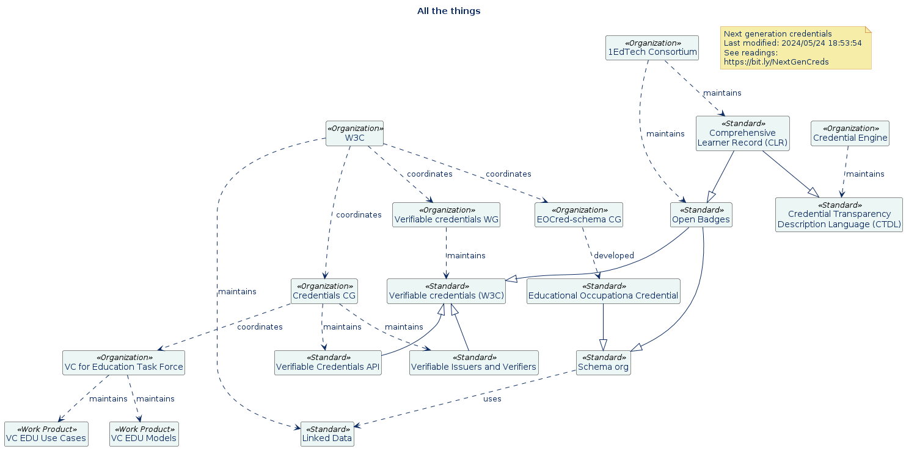
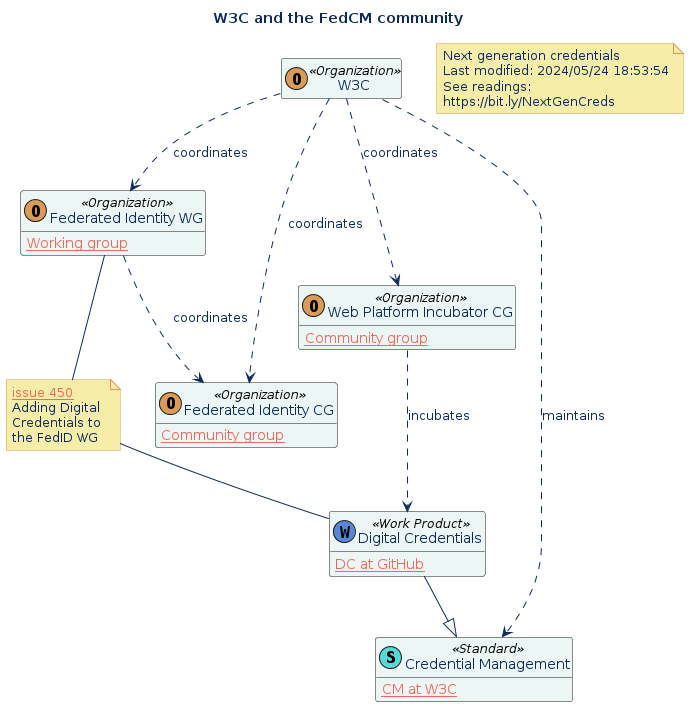

# Readings and reviews of next generation credentials

* [EdTech standards survey](./docs/EdTech.md)
* Notes and citations at [Zotero](https://www.zotero.org/groups/5541646/nextgencredentials)

## High level interrelationships of standards

## W3C Standards

### W3C and verifiable credentials

[Click to open diagram with links in browser](./diagramsExport/W3CTaxon-VC/W3CTaxonVC.svg)

### W3C and FedCM

[Click to open diagram with links in browser](./diagramsExport/W3CTaxon-VC/W3CTaxonFedCM.svg)

