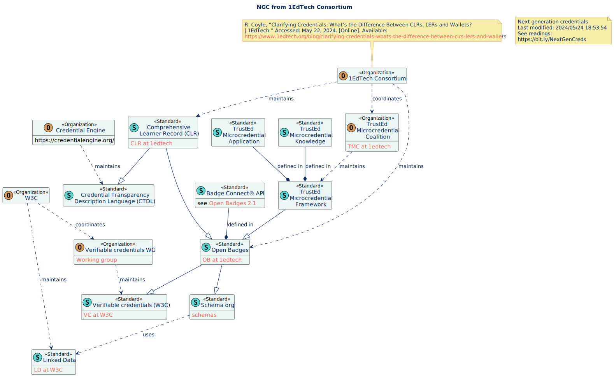

# 1EdTech's credential standards

Created: 2024/05/24 13:33:19
Last modified: 2024/05/24 16:55:11

> The 1EdTech community of leaders across K-12, higher education, and edtech suppliers is committed to building an open, trusted, and innovative digital learning ecosystem at every level.

The 1EdTech ecosystem of standards for credentials is based on the W3C Verifiable Credentials. 

