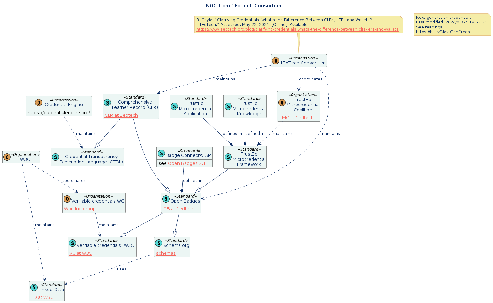

# Education credential standards

Created: 2024/05/24 13:33:19
Last modified: 2024/05/24 18:50:49

Some of the earliest use cases for self sovereign identity and verifiable credentials were sharing education transcripts.  [See "The Domains of Identity & Self-Sovereign Identity", Kaliya Young, 10/18/2018](http://opentranscripts.org/transcript/domains-self-sovereign-identity/). That use case has led to an ecosystem of standards for sharing transcript and credentials earned through education.

## 1EdTech and Credential Engine ecosystem of standards

1EdTech and Credential Engine publish standards under terms that facilitate broad usage and adoption. Their standards are published with open access, meaning that any organization can implement them without incurring licensing fees.

### Open Badges

The foundation of the [1EdTech](https://www.1edtech.org/) ecosystem is the [Open Badges](https://www.1edtech.org/standards/open-badges) standard. Open Badges extend the [W3C Verifiable Credentials](https://www.w3.org/TR/vc-data-model/) standard, enabling the digital representation of learning achievements.

### Credential Transparency Description Language (CTDL)

The [Credential Engine](https://credentialengine.org/)  organization contributes to this ecosystem with the [Credential Transparency Description Language (CTDL)](https://credentialengine.org/credential-transparency/ctdl/). CTDL standardizes the description of credentials, facilitating transparency and interoperability among different credentialing systems. documentation for a family of RDF-based schemas for describing credentials and competencies 

### Comprehensive Learner Record Standard™

Building on Open Badges, 1EdTech's [Comprehensive Learner Record (CLR) Standard™](https://www.1edtech.org/standards/clr) offers a detailed format for describing a learner's educational achievements, including transcripts and other academic records. The CLR Standard™ uses its own specifications to ensure that all credentials are interoperable and can be easily shared and verified across different platforms. The CLR Standard™ is designed to work seamlessly with CTDL, ensuring a unified approach to credentialing across the education sector.

### Microcredential Standards

[Various microcredential standards](https://www.1edtech.org/program/tmc) within the 1EdTech organization support the recognition of smaller units of learning, such as completion of final exams, class projects, or labs. These microcredentials are designed to complement traditional academic records, providing a more granular view of a learner's accomplishments.

## W3C and Schema.org

W3C (World Wide Web Consortium) standards have open and royalty-free usage terms, which are designed to encourage widespread adoption and implementation. 

The W3C's Linked Data Platform (LDP) standard was officially published as a W3C Recommendation in 2015.

Schema.org defines relationships and data terminology that can be expressed as linked data. It was founded in 2011 to create and support a common and open set of schemas.

### Educational Occupational Credential linked data schema

The [W3C Educational and Occupational Credentials in schema.org  (EOCred-schema) Community Group](https://www.w3.org/groups/cg/eocred-schema/) developed a [comprehensive linked data schema](https://schema.org/EducationalOccupationalCredential) to describe: 

> An educational or occupational credential. A diploma, academic degree, certification, qualification, badge, etc., that may be awarded to a person or other entity that meets the requirements defined by the credentialer.

This linked data schema complements the [CTDL](https://credentialengine.org/credential-transparency/ctdl/) described above.

###  W3C Verifiable Credentials for Education Task Force

The W3C [Verifiable Credentials for Education Task Force](https://w3c-ccg.github.io/vc-ed/) has two work products to inform analysis of the use of Verifiable Credentials in education:

* [VC EDU Use Cases](https://w3c-ccg.github.io/vc-ed-use-cases/)
* [VC EDU Models](https://w3c-ccg.github.io/vc-ed-models/)

Both have the status of "Draft Community Group Report" and seem finalized. The use cases consider formal, informal, and non-formal education and training contexts. 

TODO: create a diagram of the VC EDU Model.

### 

## Other reports and standards of note

The [T3 Innovation Network of the US Chamber of Commerce's](https://www.uschamberfoundation.org/solutions/workforce-development-and-training/t3-innovation-network) produced a specification for a [Learning and Employment Record (LER) Wrapper and Wallet](https://cdn.filestackcontent.com/preview/FeqEJI3S5KelmLv8XJss) in 2020. This standard leverages the Verifiable Credentials standard for creating, sharing, and verifying  credentials, references Open Badges, and aligns with the Comprehensive Learner Record Standard™. It introduces specific requirements and functionalities for a digital wallet that would  support broad set of learning and employment records. It includes a specification of security features and APIs for integration with existing systems.

_Readings at [Zotero](https://www.zotero.org/groups/5541646/nextgencredentials)._
_ChatGPT was consulted in producing this writeup._