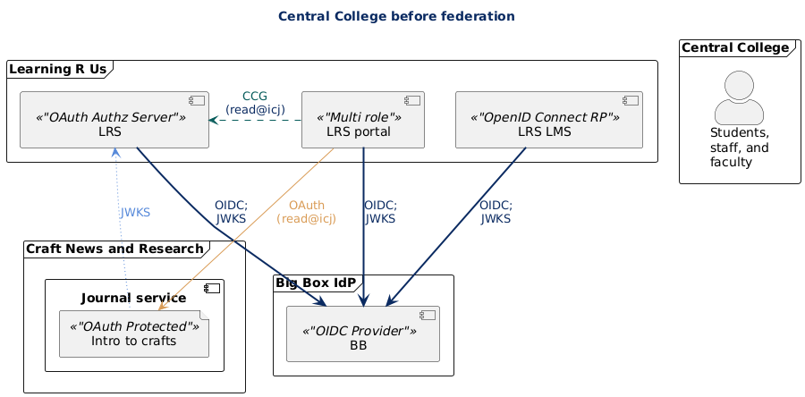
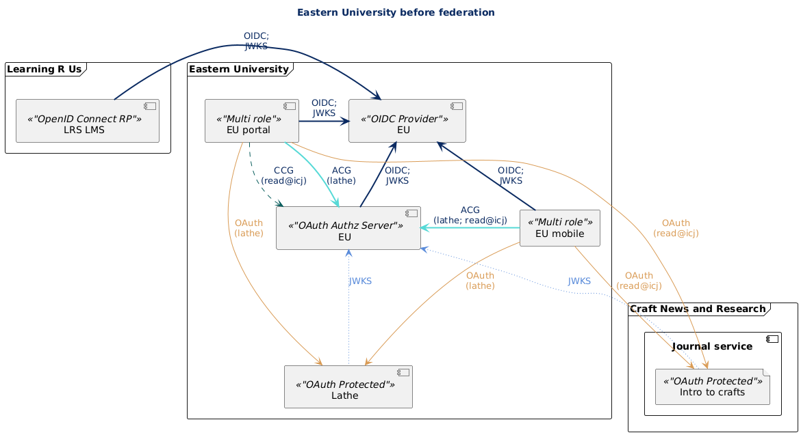
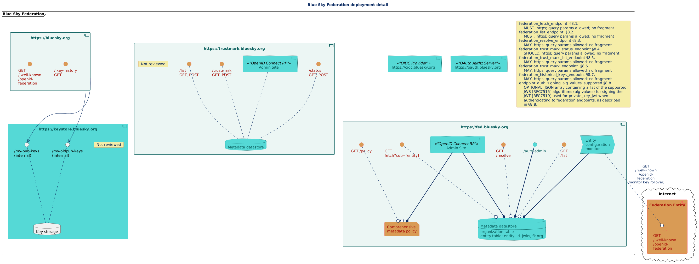
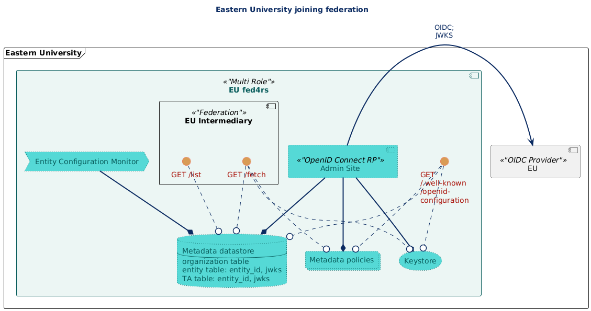

# Toy universe for exploring OpenID Federation

Last modified: 2025/03/28 18:34:05

- [Toy universe for exploring OpenID Federation](#toy-universe-for-exploring-openid-federation)
  - [Before federation](#before-federation)
  - [Blue Sky Federation](#blue-sky-federation)
  - [Eastern University: Joining a federation and registering an intermediary](#eastern-university-joining-a-federation-and-registering-an-intermediary)
  - [Central College: Joining a federation and registering an OP](#central-college-joining-a-federation-and-registering-an-op)
    - [Scope registration](#scope-registration)
    - [Central College and the Big Box OpenID Connect OpenID Provider](#central-college-and-the-big-box-openid-connect-openid-provider)
  - [Eastern University: intermediary OP choices](#eastern-university-intermediary-op-choices)
    - [fed4RS acting as a crutch for the IdP](#fed4rs-acting-as-a-crutch-for-the-idp)
    - [fed4RS as a proxy for the IdP](#fed4rs-as-a-proxy-for-the-idp)
    - [Big Box IdP in both local fed and Blue Sky Fed](#big-box-idp-in-both-local-fed-and-blue-sky-fed)
  - [Federation requirements for members](#federation-requirements-for-members)
    - [OpenID4RS is silent regarding member data attribute and intermediary capability enforcement with metadata policy](#openid4rs-is-silent-regarding-member-data-attribute-and-intermediary-capability-enforcement-with-metadata-policy)

## Before federation

The toy universe has been populated with an extensive set of organizations to establish a variety of interrelationships to simulate different types of participants in research and scholarship (including virtual organizations), plus different types of plausible future access and attribute relationships. [The initial outline](./ModelUniverse-v1.md) goes into extensive detail.

**For the initial exploration in the universe, the important participants are Eastern University, which has substantial internal technical services, and Central College, which uses cloud providers for the technical services relevant to federation.** These diagrams are for reference and are not necessary for understanding the following.

## Blue Sky Federation

A toy infrastructure for the Blue Sky Federation is described in the following diagram, in order to depict a plausible infrastructure for managing the federation. It is a **toy** for exploring possibilities.

## Eastern University: Joining a federation and registering an intermediary

[This text heavy sequence diagram (png)](../out/toyUniverse4PORE/technical/universe02-seq-BootstrapEUfed4rs/universe02-seq-BootstrapEUfed4rs.01.png) walks through Eastern University joining Blue Sky and registering an intermediary.

In the toy universe, there is an open source application, fed4rs, that acts as an intermediary and fills gaps for applications that do not yet support OpenID Federation. For example, it might host `.well-known/openid-configuration` endpoints for any entities not otherwise prepared to do so, act as a keystore for entities, and so on.

The sequence diagram  considers what information is needed in the initial registration and led to the section below discussing [Federation requirements for members](#federation-requirements-for-members)

Then a trivial examination of initial application configuration documents

- configuring the intermediary to have a URL that will be allowed by the configuration entity name constraints registered with the federation
- and configuring the intermediary to use un-federated authentication against the campus OP.

**Monitoring the trust anchor for key rollover.** Next is the data needed to establish the trust chain. At the time of joining the federation, the University receives a jwks file documenting the federation -- the trust anchor's -- key. The organization could simply trust the TLS connection to the federation's `/.well-known/openid-federation` endpoint, but instead, this participant wants to depend completely on the federation practices. The fed4rs service provides a monitoring service that checks the Entity Configuration for the trust anchor watching for key rollover. To complete monitor and to have the correct `authority hints` in its own Entity Configuration, the application needs the federation entity ID.

In return, the application has its own entity ID and its jwks file to be submitted to the federation.

**Registration of the intermediary** then is simply providing the entity ID and jwks.

In this toy universe it seems that it might be useful for the intermediary to have a copy of the metadata policy that Blue Sky will apply to it, so the federation provides it, and the fed4rs service consumes it, and then generate's its first entity statement.

**Monitoring the subordinate for key rollover.** While the federation may have manual ways for member organizations to provide new keys, the federation should be able to simply monitor the subordinate entity's `/.well-known/openid-federation` endpoint to watch for key rollover.  

## Central College: Joining a federation and registering an OP

[This text heavy sequence diagram (png)](../out/toyUniverse4PORE/technical/universe02-seq-CCidp/universe02-seq-BootstrapEUfed4rs.01.png) walks through Central College joining Blue Sky and registering an OP.

When Central College joins Blue Sky federation, it has no intent of running an intermediary. The initial registration is still very similar to Eastern University, collecting default organizational details, and providing the registrant with the public key jwks file to bootstrap trust.

### Scope registration

In this universe, the R&E community registered a new JWT claim with `IANA JSON Web Token Claims Registry`, `shibmd_scope`. This `shibmd:Scope` equivalent is one of the more important elements for the federation to proof. The Central College staff pick one of the standard Domain Control Validation methods and prove their control over the  `shibmd_scope` with the expectation that the control will be repeatedly reverified.

### Central College and the Big Box OpenID Connect OpenID Provider

Trust anchor configuration: Central College's cloud IdP is Federation ready. The staff member first configures Blue Sky as the trust anchor, providing the entity ID and the public keys as jwks (see Section 11.3 Redundant Retrieval of Trust Anchor Keys).

**When entity IDs are independent of the registering organization** Blue Sky has made the decision that if a reasonably efficient process can be used to verify a specific organization has contracted with a vendor, they will register that vendor's entity ID. The owner of the DNS endpoint in an entity ID does not need to be the same as the registering party. Blue Sky is staking authentication affiliation on the  `shibmd_scope` claim, and expects participants to ensure they are receiving scoped subject identifier claims that are constrained by metadata.

**OpenID Connect OpenID Provider configuration** In the toy universe, the Blue Sky federation has a number of other requirements for OPs, including

- requiring that the OP provide its keys via a `signed_jwks_uri`,
- disallowing "ES256" due to a vulnerability found in the toy universe,
- requiring support for "ShinyPostQ", an algorithm available in the toy universe.

When Blue Sky issues Subordinate Statements for intermediaries and for OpenID Connect OpenID Providers, it includes in the `metadata_policy` claim for entity types of OpenID Connect OpenID Providers

- the `value` operator and the explicit setting of the `shibmd_scope` claim,
- the `essential` operator for the `signed_jwks_uri` parameter, ensuring that if it is absent, the trust chain fails,
- the `subset of` operator that lists all acceptable algorithms for various algorithm parameters
- the `superset of` operator that lists all required algorithms for various algorithm parameters.

**Prohibited algorithms** Obviously, the metadata policy just removes the prohibited algorithm and does not ensure that the algorithm is off at the service. The only way the federation can validate that such algorithms are truly off would be to probe.

## Eastern University: intermediary OP choices

Eastern University's existing OP is only partly federation ready.

- It must be manually provisioned with the trust anchor's key (no rollover support) or it can simply pull from the trust anchor's Entity Configuation;
- it only uses a trust anchor's resolve endpoint and cannot resolve on its own;
- it does not support a `signed_jwks_uri`; and
- it must be manually provisioned with its own federation key pair.

In the toy universe, Eastern University considers several options, two options using capabilities of the fed4RS application can solve some of the presented issues with the existing IdP, and the third moving to Big Box

### fed4RS acting as a crutch for the IdP

fed4RS  can issue its own entity IDs to its subordinates,  host the `/.well-known/openid-federation` and  `signed_jwks_uri` endpoints for those entities, and offer a number of keystore services that help applications function in the new federation space.

It also can offer a multi-federation resolve service, resolving using it's external trust anchors or resolving internal federations where it is the trust anchor.  

This solution would mean the federation key pair for the IdP resides in the fed4RS service: the  `/.well-known/openid-federation` and  `signed_jwks_uri`  documents are signed by fed4RS. However, the content of the `signed_jwks_uri`  is retrieved from the IdP's `jwks_uri`, so the campus DNS is part of the trust fabric.

The IdP only supports one trust anchor, and Eastern University wants an internal IdP.

### fed4RS as a proxy for the IdP

fed4RS can proxy authentication from an OP that doesn't interfederate well or support the newer cryptographic algorithms that Blue Sky requires. This is attractive, although there are staff concerned about introducing intermediate hops in the authentication path.

### Big Box IdP in both local fed and Blue Sky Fed

Because the intermediary is constrained to issue entity IDs that are in eu.edu, if Eastern University moved to Big Box, the fed4RS system couldn't include that IdP as an intermediate to Blue Sky: they'd have to register the Big Box IdP directly with Blue Sky. 

However, assume Eastern University ALSO wants to have its own internal federation, where the trust anchor is the EU fed4RS service, not Blue Sky.  If they chose to replace their current IdP with Big Box, they could add both Blue Sky and the EU fed4RS service as a trust anchors, and register the OP with both Blue Sky and the EU fed4RS system. As a result the Big Box Idp would list both Blue Sky and the EU fed4RS service in the `authority_hints`.

If some system, using a superior to Blue Sky as a trust anchor,  wanted to build the trust chain for this IdP, it might not know to prefer the Blue Sky authority to the EU fed4RS authority. If it tried building a chain through EU fed4RS like so

* Big Box Entity Configuration
* EU fed4RS Subordinate Statement
* Blue Sky Subordinate Statement
* Superior to Blue Sky....

Blue Sky could ensure it would fail, because Blue Sky's subordinate statement would have a `constraints` claim on the EU fed4rs intermediary specifying the `naming_constraints` that permit only https://eu.edu entity IDs.

The chain through Blue Sky would succeed, and that would ensure that Blue Sky had validated the relationship of the IdP to Eastern University.

## Federation requirements for members

> **Warning** How an immediate superior entity enforces metadata quality appears to allow both assertion of metadata and use of metadata policy. The toy universe might have made poor choices. [More discussion](./metadatapolicy-options.md) is sketched out at the link.

Initial exploration of the toy universe is to support something similar to our SAML federations but with intermediaries allowed between the federation and leaf entities. However, federation asserted responsibility for entities is important and so this initial exploration looks at how the metadata can meet standards currently enforced by federation operators.

In this model, the Blue Sky Federation will use metadata policy to assure that all trust chain evaluations involving Blue Sky end up with metadata that lists includes the legal name of the organization that registered the entity directly or via an intermediary using the attribute  `organization_name#x-legal`. (See RFC5646.) Metadata policy will use the `value` operator to ensure the attribute is present and has the federation specified value.

As intermediaries might want their leaf entities to be able to provide other organization names for display purposes, so the federation metadata policy is silent regarding all names of the form  `organization_name#[language tags]`. However, to ensure interoperability, the metadata policy for OPs and RPs has uses the `default` operator for the untagged `organization_name` so that all OPs and RPs will have a display name.

[More detailed discussion of member level data elements and their use](./metadatapolicy-members.md) is available: the short of it is that Blue Sky Federation can ensure that the metadata of entities registered by intermediaries have certain values by use of the metadata policy, because the metadata policy is expressed at the *entity* level.

The metadata policy that Blue Sky issues as part of its Subordinate Statements about its allowed intermediaries can include:

- constraints on the entity ID names that that subordinate is allowed to issue
- constraints on the entity types that a subordinate is allowed to issue
- restrictions on values for specific metadata parameters per entity type

### OpenID4RS is silent regarding member data attribute and intermediary capability enforcement with metadata policy

The policy controls allow a great deal of flexibility. OpenID4RS could specify answers to the following questions.

**What member organizational metadata must be federation validated values, for all or specific entity types?**

The toy universe is playing with legal names vs display names and can enforce all entities having the legal name as part of the metadata. What attributes are required for specific entity types? What attribute values should be asserted by the federation (using the `value` operator)?

Note that with intermediaries the enforcement is ... blunt. When the intermediary is registered it can provide "common" values and those can be defaults or overrides. Or perhaps it is sufficient that the intermediary's entity statement has those federation validated values.  

**What entity types must be registered by the federation and what may be registered by intermediaries?**

A federation can control what entity types its intermediaries can issue using the `allowed_entity_types` attribute in the `constraints` claim for intermediaries it registers.  A federation could choose to only allow intermediaries to register RPs and insist that all OIDC OPs are registered directly with the fed.

An interfederation trust anchor would currently have less technical control over enforcing what federations allow intermediaries to do via metadata policy. Presumably, the interfederation's Subordinate Statements about member federations allow OIDC OPs.

If the OIDF spec were changed, the control of `max_path_length` might be moved from the `constraints` claim into the entity type part of the `metadata_policy` claim and then the depth for different type entities could be enforced in the trust chain.

Legal agreement could be sufficient, as could also be separate entity IDs for the federation as direct registrar and the federation as registrar of intermediaries.
